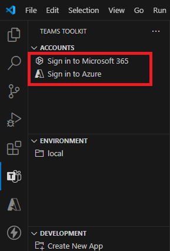
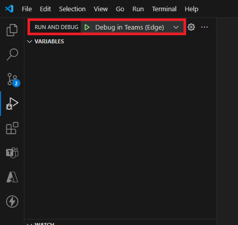
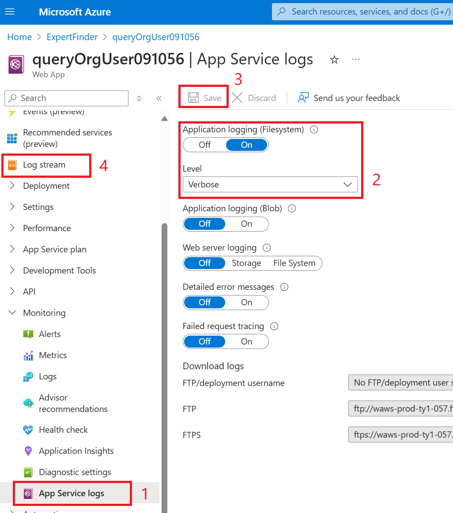

# Expert Finder 訊息應用程式與 SSO

此範例展示了整合 Microsoft Copilot 的 Teams 應用程式，透過 Microsoft Graph API 根據技能、地點等關鍵字搜尋專家。該應用程式支援單一登入 (SSO)，提供更佳的使用者體驗與身份驗證功能。使用者只需在 Teams Message Extension 中開啟應用程式，並輸入技能如 Azure、AI 等關鍵字，或在 Microsoft 365 Copilot 中以自然語言，系統就會回傳符合條件的專家名單。

### 目錄

- [先決條件](#先決條件)
- [本機設定與執行範例](#本機設定與執行範例)
- [部署應用程式至 Azure](#部署應用程式至-azure)
- [在 Teams 與 Microsoft 365 Copilot 使用應用程式](#在-teams-與-microsoft-365-copilot-使用應用程式)
- [疑難排解](#疑難排解)
- [延伸閱讀](#延伸閱讀)

## 先決條件

- [Node.js 18.x](https://nodejs.org/download/release/v18.18.2/)
- [Visual Studio Code](https://code.visualstudio.com/)
- [Teams Toolkit](https://marketplace.visualstudio.com/items?itemName=TeamsDevApp.ms-teams-vscode-extension)
- 您需要擁有 Microsoft 工作或學校帳戶，並具備[上傳自訂 Teams 應用程式的權限](https://learn.microsoft.com/microsoftteams/platform/concepts/build-and-test/prepare-your-o365-tenant#enable-custom-teams-apps-and-turn-on-custom-app-uploading)。此帳戶還需要具備 Microsoft 365 的 Copilot 授權，才能在 Copilot 中使用該擴充功能。

## 本機設定與執行範例

1. 確保已安裝 [Visual Studio Code](https://code.visualstudio.com/docs/setup/setup-overview) 和 [Teams Toolkit](https://marketplace.visualstudio.com/items?itemName=TeamsDevApp.ms-teams-vscode-extension) 擴充功能。
1. 複製儲存庫：

    ```bash
    git clone https://github.com/yuting1008/expert-finder.git
    ```
1. 將目錄切換至 `expert-finder`，並使用 Visual Studio Code 開啟。
1. 在 VS Code 中選擇 **檔案 > 開啟資料夾**，並選擇範例專案的資料夾。
1. 使用 Teams Toolkit 擴充功能，使用您的 Azure 帳戶和 Microsoft 365 帳戶登入，確保擁有上傳自訂應用程式的權限。 \
     ⮕
    
1. 選擇 **偵錯 > 啟動偵錯** 在 Teams 網頁版客戶端執行應用程式。偵錯開始後，瀏覽器將開啟並進入 Teams 網頁版客戶端，您即可測試此應用程式。 \
    

## 部署應用程式至 Azure

1. 確保應用程式已照上述步驟在本機成功運行測試環境，並解決任何潛在的錯誤。
1. 開啟 Teams Toolkit，選擇 **Provision**（佈建）於生命周期區塊下，此動作會在 Azure 中建立必要的資源。 \
    
1. 選擇 **Deploy**（部署）於生命周期區塊下，將應用程式部署至 Azure。
1. 選擇 **Publish**（發佈）於生命周期區塊下，將應用程式發佈到 Teams 系統管理中心。
1. 前往 [**Teams 系統管理中心**](https://admin.teams.microsoft.com/) 並批准應用程式。
1. 打開 Teams 應用程式商店並安裝應用程式。 \
    
> 如果您修改了原始碼，請重新點擊 **Deploy** 以將變更部署至 Azure。


## 在 Teams 與 Microsoft 365 Copilot 使用應用程式

前往 Microsoft 365 Copilot 聊天介面。在介面右上角，您可以看到 Expert Finder 代理程式。點擊並開始使用 Expert Finder。

#### 使用 SSO 驗證與授權彈窗

首次使用時，會彈出登入視窗，完成 SSO 後，即可正常使用。

#### 在 Copilot 中依技能與辦公室地點搜尋


以下是一些範例提示：
1. `Find experts with skill in Azure.`
2. `Find experts with skill in Python and who are from Taipei.`
3. `Find experts with skill in Azure and available for interview.`

#### 在聊天中嘗試訊息擴充功能


## 疑難排解

1. 如果部署應用程式後遇到任何錯誤，可在 Azure App Services 中查看錯誤日誌。首先，您需要啟用 Azure 網頁應用程式的日誌流。
    - 前往 Web App 的 **監控 > 應用程式服務日誌**。
    - 啟用 **應用程式日誌（檔案系統）** 並點擊 **儲存**。
    - 接著可在 **日誌流** 中查看應用程式日誌。 \
        
1. 如果無法上傳自訂應用程式，您可以使用 [Microsoft 365 開發帳戶](https://learn.microsoft.com/en-us/office/developer-program/microsoft-365-developer-program)，或聯絡租戶管理員為組織開啟上傳自訂應用程式的權限。以下是管理員啟用權限的步驟：
    - 若無法上傳自訂應用程式，會顯示以下錯誤： \
        
    - 進入 [**Teams 系統管理中心**](https://admin.teams.microsoft.com/)。
    - 前往 **Teams 應用程式 > 權限原則**。
    - 點擊 **Global (Org-wide app default)**。 \
        
    - 啟用 **上傳自訂應用程式**。 \
        

## 延伸閱讀

- [Message extensions for Microsoft Copilot for Microsoft 365](https://learn.microsoft.com/en-us/microsoft-365-copilot/extensibility/overview-message-extension-bot)
- [Get started with Microsoft Graph](https://developer.microsoft.com/en-us/graph)


