# Expert Finder message extension sample with SSO

This sample demonstrates a Teams message extension integrated with Microsoft Copilot, enabling users to efficiently search experts with Microsoft Graph API based on their skills, location, and availability. The extension features Single Sign-On (SSO) for enhanced user experience and authentication. 

### Table of Contents
- [Prerequisites](#prerequisites)
- [Setup and run the sample locally](#setup-and-run-the-sample-locally)
- [Deploy the app to Azure](#deploy-the-app-to-azure)
- [Test the app in Teams and Copilot for Microsoft 365](#test-the-app-in-teams-and-copilot-for-microsoft-365)
- [Troubleshooting](#troubleshooting)
- [Further reading](#further-reading)

## Prerequisites

- [Node.js 18.x](https://nodejs.org/download/release/v18.18.2/)
- [Visual Studio Code](https://code.visualstudio.com/)
- [Teams Toolkit](https://marketplace.visualstudio.com/items?itemName=TeamsDevApp.ms-teams-vscode-extension)
- You will need a Microsoft work or school account with [permissions to upload custom Teams applications](https://learn.microsoft.com/microsoftteams/platform/concepts/build-and-test/prepare-your-o365-tenant#enable-custom-teams-apps-and-turn-on-custom-app-uploading). The account will also need a Microsoft Copilot for Microsoft 365 license to use the extension in Copilot.


## Setup and run the sample locally

1. Ensure you have installed [Visual Studio Code](https://code.visualstudio.com/docs/setup/setup-overview) and [Teams Toolkit](https://marketplace.visualstudio.com/items?itemName=TeamsDevApp.ms-teams-vscode-extension) extension.
1. Clone the repository

    ```bash
    git clone https://github.com/yuting1008/expert-finder.git
    ```
1. Navigate to the `expert-finder` folder and open it with Visual Studio Code.
1. Select **File > Open Folder** in VS Code and choose this samples directory from the repo.
1. Using the extension, sign in with your Azure account and Microsoft 365 account where you have permissions to upload custom apps. \
    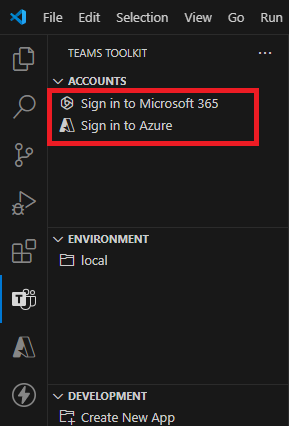 ⮕
    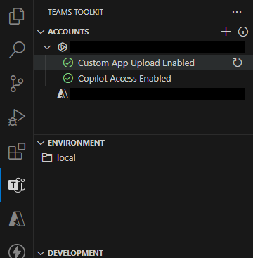
1. Select **Debug > Start Debugging** to run the app in a Teams web client. Once the debugging process starts, your default browser will open and navigate to the Teams web client, allowing you to test the application. \
    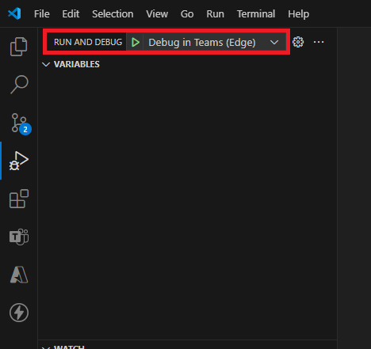

## Deploy the app to Azure

1. Ensure the application is running locally to identify and resolve any potential bugs before proceeding.
1. Open the Teams Toolkit and select **Provision** under the Lifecycle section. This action will create the required resources in your Azure environment.
1. Select **Deploy** under the Lifecycle section. This action will deploy the base folder to Azure. 
1. Select **Publish** under the Lifecycle section. This action will publish the application to Teams admin center.
1. If you make any changes to the source code, click **Deploy** again to apply the changes to the deployed app.
    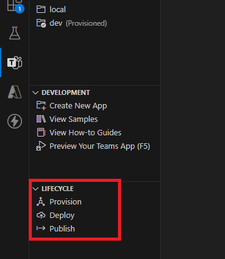


## Test the app in Teams and Copilot for Microsoft 365

Navigate to the Microsoft Copilot for Microsoft 365 chat. Check the upper right of the chat user interface. You should see the Expert Finder as and agent. Click it and start using Expert-finder plugin.

#### SSO auth with consent popup when sign in button is clicked
On first use, a window requesting for Sign In pops-up and once SSO is completed, the user flow continues as usual.
<!-- 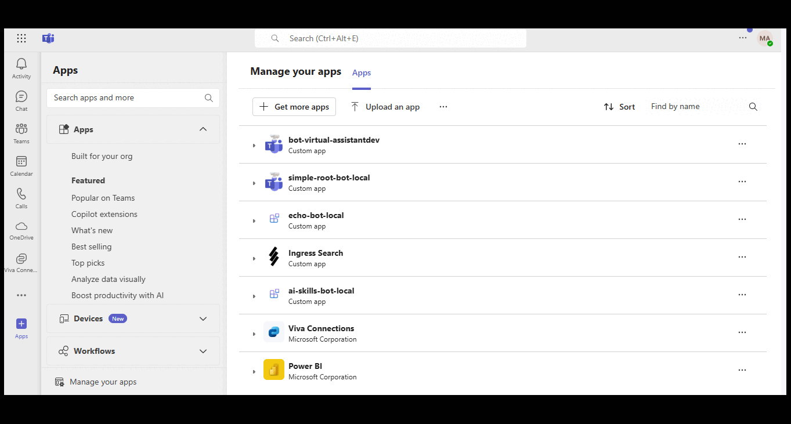 -->
<!-- 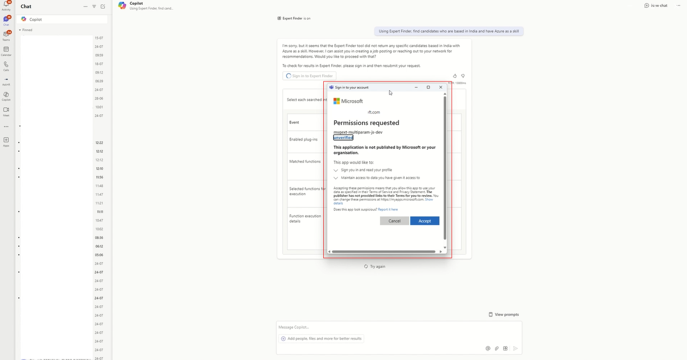 -->

#### Search based on skills and country
<!-- 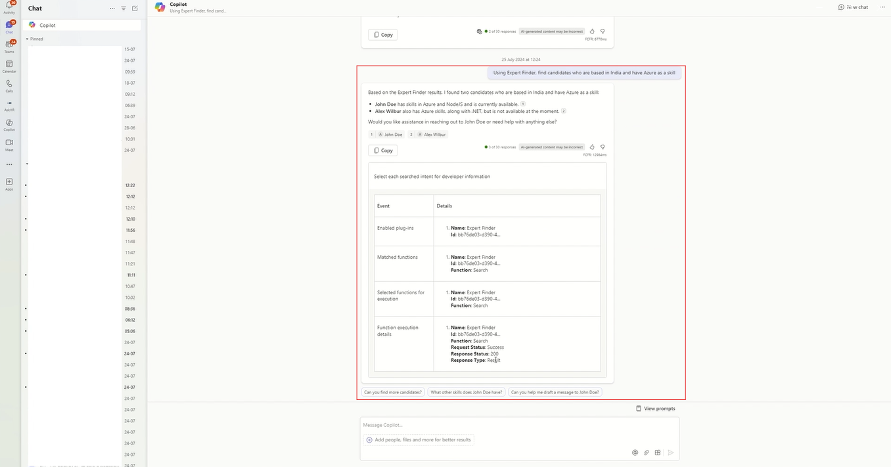 -->

Here are some sample prompts you can try : 
1) `Find experts with skill in Azure.`
2) `Find experts with skill in React and who are from Taipei.`
3) `Find experts with skill in Azure and available for interview.`

#### Try out message extension in chat
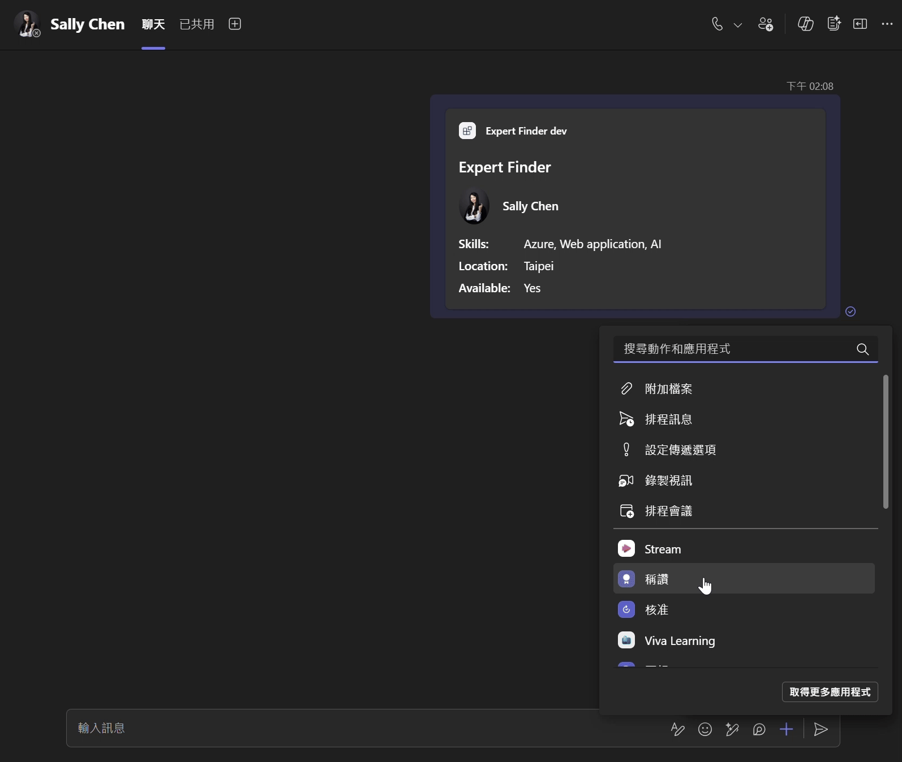


## Troubleshooting
1. If you encounter any errors after deploying the app, you can check the error log on Azure App Services. First, you need to enable the Azure web app log stream. 
    - Navigate to Web App **Monitoring** > **App Service Logs**.
    - Enable **Application logging (Filesystem)** and click **Save**. 
    - You will then be able to see the log of the web app in **log stream**. \
        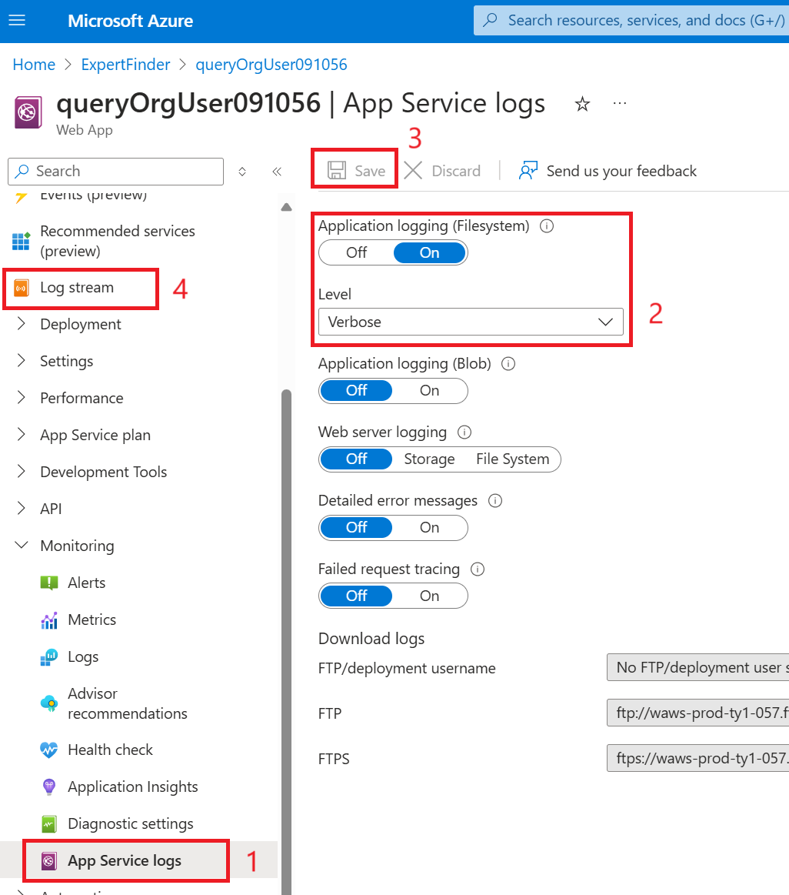
1. If custom app uploaded is disabled, you can either use [Microsoft 365 development account](https://learn.microsoft.com/en-us/office/developer-program/microsoft-365-developer-program) or contact your tenant administrator to turn on the upload custom app permission for your organization. Below are the steps to enable permission as a Teams admin:
    - When the custom app upload is disabled, the following error is displayed: \
        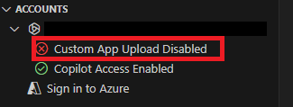
    -  Go to the [**Teams admin center**](https://admin.teams.microsoft.com/).
    -  Navigate to **Teams apps** > **Permission policies**.
    -  Click on **Global (Org-wide app default)**. \
        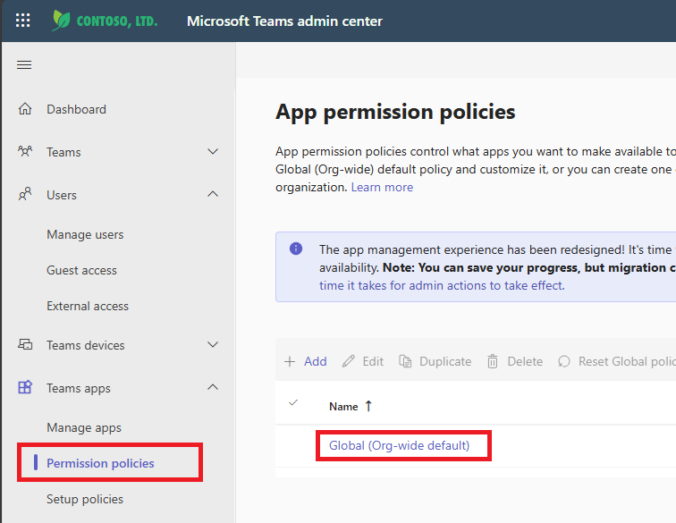
    -  Enable **Upload custom app**. \
        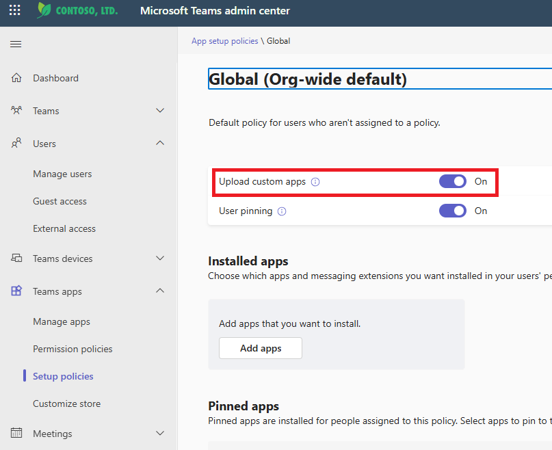

## Further reading

- [Message extensions for Microsoft Copilot for Microsoft 365](https://learn.microsoft.com/en-us/microsoft-365-copilot/extensibility/overview-message-extension-bot)
- [Get started with Microsoft Graph](https://developer.microsoft.com/en-us/graph)


